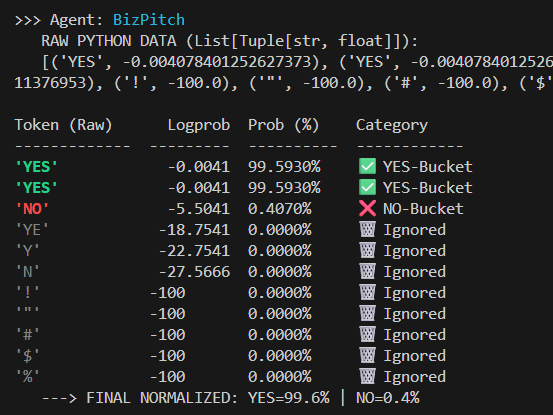

## Agent Routing with Deep Dive Logprobs

CLI demo that routes a user query to the best-fitting helper agent and prints a probability-aware audit trail. It uses LangChain with OpenAI chat logprobs to show exactly why the router said YES or NO for each agent.

### Prerequisites
- Python 3.13+
- uv installed (`pip install uv` if needed)
- An OpenAI API key available as `OPENAI_API_KEY` (put it in a local `.env`)

### Install and run
```bash
# optional: create .env with your key
echo OPENAI_API_KEY=sk-... > .env

# run the built-in demo with several queries
uv run python main.py

# route a custom query
uv run python main.py ask --query "Write a short startup pitch for a coffee app."
```

### What you will see
- A summary table sorted by `p(YES)` per agent.
- A deep-dive section per agent with every considered token, its logprob, and a normalized YES/NO split.
- Example screenshot:  


In the deep-dive, tokens normalized to YES/NO show which way the model leaned; the final line reports the normalized YES vs NO percentages for that agent. Use the summary table to pick the top agent, and the deep-dive to debug or tune the routing prompt.

- Idea first read: https://cookbook.openai.com/examples/using_logprobs